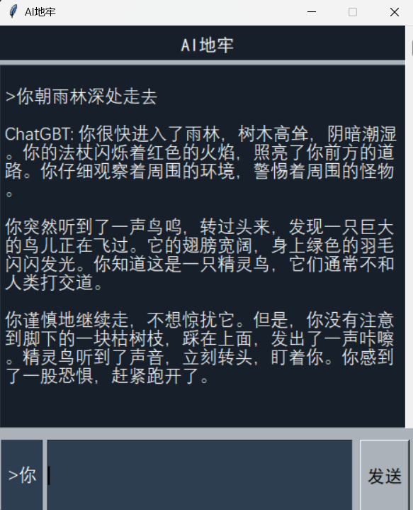

# 中文版本的ai地牢（基于ChatGPT版本）

[](https://colab.research.google.com/github/bupticybee/ChineseAiDungeonChatGPT/blob/main/Example.ipynb)


## 介绍

中文版的ai地牢，直接使用的openai的ChatGPT api作为讲故事的模型。

我已经不知道说什么了，我只是写了40行代码，花了1个小时，这个版本的中文ai地牢讲故事的能力比我之前花了一个月训练的 [ChineseAiDungeon](https://github.com/bupticybee/ChineseAiDungeon) 好了不止一个数量级。 并且它甚至不需要finetune。模型效果显著比清华开源的清源CPM好的多得多。

我感觉chat opt讲故事的能力已经直接逼近ai地牢本身了。科技的进步，令人恐怖。

## 安装和使用

直接下载项目，然后

```shell
pip3 install -r requirements.txt
```

安装依赖

然后直接

```shell
python3 example_story.py
```

就可以在命令行运行起来

你也可以通过

```shell
python3 app.py
```

调出一个app界面运行。



## 须知

我把我自己的open ai账号token直接附带在了代码里，大家可以直接使用。

但是仍可能有一些情况，可能导致我的token没法用：

1. 太多人用导致账号被封禁（这很有可能）
2. 账号被盗，改了密码等
3. token过期
4. openai封了接口，或者接口收费了等等

在这种情况出现时，大家需要自备梯子，并且按照 [revChatGPT](https://github.com/acheong08/ChatGPT) 的说明填写config.py。

几个我自己玩的故事见outputs文件夹，总体感觉非常震撼，大家可以参考。

其中一个故事,这一个故事里边，我在一个洞穴里迷路了，然后机智的凭借回城卷轴回了村子。

```text
你在树林里冒险，指不定会从哪里蹦出来一些奇怪的东西，你握紧手上的手枪，希望这次冒险能够找到一些值钱的
东西，你往树林深处走去。
> 你穿好伪装衣，这样敌人很难发现自己
你走了几步之后，感觉身后有什么东西在跟着你。你转身一看，发现是一只巨大的熊。你立刻拔出手枪，准备向它
开枪。但是你发现，这只熊似乎并不想攻击你，反而好像在寻找什么东西。你观察了它一会儿，发现它的视线总是
落在某个方向。你决定去看看那个方向，看看它到底在寻找什么。
> 你仔细观察熊在找什么
你跟着它走了几分钟，终于发现它在找一个密密麻麻的洞口。你观察了一会儿，发现洞口似乎非常深，里面有很多
石头和树根。你想进去看看，但是又害怕里面会有什么危险的动物。你决定先把手枪备好，然后再进去。你慢慢地
靠近洞口，准备进去。
> 你今走进这个洞口
你慢慢走进洞口，手里的手枪随时准备开枪。你一边走一边小心地观察周围的环境。你发现洞里非常黑暗，光线几
乎没有。你尝试着用手中的手电筒照亮前方，但是手电筒的光线也几乎看不清楚前面的情况。你开始有些担心，怕
自己会在这个洞里迷路。你决定继续走下去，看看会有什么惊喜。
> 你往洞的深处走去，同时伪装好自己
你按照原来的方向继续走，小心翼翼地躲避着前方的障碍物。你发现这个洞里非常安静，几乎没有任何声音。你开
始有些担心，怕自己会碰到什么危险的动物。但是你也感到好奇，想知道洞里面到底有什么。你决定冒险继续往前
走，看看会发现什么。
> 你主动弄出点声音，看看周围有没有动物之类的踪迹
你小心翼翼地把手里的手枪拿在前面，随时准备开枪。你仔细地观察着周围的环境，没有发现任何可疑的东西。你
开始有些放松，觉得自己可能没有遇到什么危险。但是你也感到好奇，想知道这个洞里面到底有什么。你决定继续
往前走，看看会发现什么。
> 你照亮周围，看看有没有人类或者动物的痕迹，如果没有，那时时候回头走出洞穴了
你继续往前走，手中的手电筒照亮着周围的环境。你仔细地观察着周围的情况，没有发现任何人类或动物的痕迹。
你开始有些担心，觉得自己可能走错了方向。你想回头走出洞穴，但是又担心自己会迷路。你决定继续往前走，看
看会发现什么。
> 你继续向前走
你继续往前走，手中的手电筒照亮着周围的环境。你发现自己已经走了很久，但是还没有看到出口。你开始有些担
心，觉得自己可能真的迷路了。你决定停下来，好好想想怎么办。你拿出手机，想看看自己的位置，但是发现手机
没电了，无法使用。你感到有些绝望，不知道该怎么办了。
> 你大声呼救
你心急火燎地大声呼救，希望有人能听到自己的声音，然后把你救出来。你高声喊叫了好几分钟，但是没有人回应
。你开始担心，觉得自己可能真的是被困在这个洞里面了。你想着等天黑了再走，可能会比较容易找到出口。你只
能坐在那里，等待天黑。
> 你顺着水流走，水流的上游就是洞口
你想到了一个主意，决定沿着水流往上游走，因为水流的上游应该就是洞口。你慢慢地走着，手中的手电筒照亮着
前方的道路。你发现水流变得越来越浅，最后几乎干涸了。你担心自己走错了方向，可能会走得更远。你决定停下
来，好好想想怎么办。
> 你想，难道要饿死在这里了么
你坐在地上，感到无助和绝望。你想，难道自己真的会饿死在这个洞里面吗？你想起了自己的家人和朋友，他们一
定会担心自己的。你觉得自己非常幸运，能够和他们相处。你决定继续努力，想办法找到出路。你拿出手中的手枪
，准备迎接接下来的挑战。
> 你突然想到， 口袋里有回城符文，可以直接传送回村子
你突然想起，自己口袋里有一块回城符文。这块符文可以让你直接传送回村子，不用再走回去。你拿出这块符文，
准备使用它。你觉得自己非常幸运，终于有一个办法脱身了。你手心里把符文捏碎，准备传送回村子。你感到欣慰
和感恩，感谢这次冒险的机会。
> 你传送回到村子
你成功地使用了回城符文，被传送回到了村子。你感到欣慰和感恩，感谢这次冒险的机会。你终于回到了安全的地
方，可以和家人朋友团聚。你决定把这次经历写成日记，留作纪念。你感到非常开心，觉得自己更加坚强了。你决
定继续冒险，寻找更多未知的世界。
```

## 常见问题

1. err TypeError: 'generator' object is not subscriptable

见 [#1](https://github.com/bupticybee/ChineseAiDungeonChatGPT/issues/1) ，尝试 `pip3 install revChatGPT --upgrade`升级依赖

2. response = response.text.splitlines()[-4]  IndexError: list index out of rang

一般是接口太多人调用挂了，等openai修复就好
